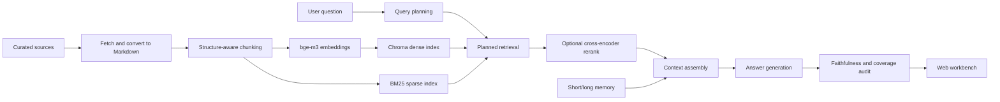

# Enterprise RAG Learning Project

一个面向学习和作品集展示的企业级 RAG Demo。项目从官方文档、论文和开源项目资料构建知识库，支持结构化切分、稠密/稀疏混合检索、query planning、planned retrieval、上下文组装、答案生成、答案审计、长对话记忆和 Web 可视化。

## 当前结果

- 知识库文档：52 篇
- 结构化 chunks：938 个
- 检索：Chroma dense retrieval + BM25 sparse retrieval + RRF
- Embedding：Ollama `bge-m3`
- 生成模型：DeepSeek API 或 Ollama 本地模型
- 可选语义重排：`BAAI/bge-reranker-v2-m3`（Transformers + CUDA FP16）
- 端到端评测：planned hybrid 10/10 通过，quality pass rate 100%
- 检索实验：direct hybrid 双指标通过率 75%，dense 基线为 62.5%
- 重排实验：planned hybrid 在 8/8 问题上保持双指标通过；cross-encoder 未提升总体 nDCG，暂不设为默认
- Planner v3 开发集：direct nDCG@10 为 0.837，planned v2 为 0.737，conservative auto 为 0.853；等待新 holdout，默认继续使用 direct

最新评测摘要：

- `eval/rag_system_full_hybrid/summary.md`
- `eval/hybrid_retrieval_experiment/summary.md`
- `eval/planned_reranker_full/summary.md`
- `notes/35_hybrid_retrieval_and_rrf.md`
- `notes/36_cross_encoder_reranker.md`

## Demo 展示

代表性问答案例见：

- `docs/demo.md`

Demo 覆盖复合问题拆解、非固定窗口 chunking、query rewrite/query expansion、Chroma metadata filter、企业级混合检索/重排，以及知识边界拒答。

## 核心能力

- 资料来源可追踪：通过 `data/source_manifests/llm_rag_sources.csv` 维护高质量来源。
- 正式入库流程：fetch -> markdown -> structure-aware chunking -> embedding -> Chroma index。
- 非固定窗口切分：按 Markdown 结构、标题和段落边界切分，再用软/硬长度约束兜底。
- Query planning：先理解问题意图，再生成子查询、分类过滤和必答方面。
- Conservative planner v3：具体问题安全退化为原查询，只对至少两个明确方面执行有上限、保留原实体的扩展。
- Planned retrieval：多子查询、多分类召回，再做融合、重排和覆盖选择。
- Hybrid retrieval：并行执行 bge-m3 向量召回和 BM25 关键词召回，通过 RRF 按排名融合。
- 可选 Cross-encoder：用问题和候选片段联合打分；支持多语种 GPU 模型、固定候选评测和小显存互斥驻留。
- 上下文组装：区分检索证据和对话记忆，避免把记忆当事实来源引用。
- 答案审计：检查引用、忠实性、相关性、覆盖度和 badcase。
- 长记忆：记录用户偏好和目标，用于连续学习场景。
- Web 工作台：可查看规划、来源、上下文、审计和记忆。

## 架构流程



## 项目结构

```text
src/                         核心 RAG 逻辑
webapp/                      本地 Web 工作台
experiments/16_llm_rag_sources/  资料抓取与 Markdown 转换
experiments/17_llm_rag_chunking/  文档切分
experiments/18_llm_rag_index/     Chroma 索引构建与搜索
experiments/22_rag_system_eval/   Web API 端到端评测
experiments/23_hybrid_retrieval_eval/  Dense/BM25/RRF 对比实验
experiments/24_cross_encoder_rerank_eval/  固定候选重排对比实验
data/source_manifests/       高质量资料来源清单
docs/                        调研记录
notes/                       学习过程与阶段复盘
eval/                        评测摘要和可再生成结果
```

## 环境准备

已经验证过的本地环境：

- Python/conda 环境：`rag-book`
- Ollama：已安装
- 本地 embedding 模型：`bge-m3`
- 可选本地生成模型：`qwen2.5:1.5b`
- 可选远程生成模型：DeepSeek API

创建或进入环境后安装依赖：

```powershell
conda activate rag-book
python -m pip install -r requirements.txt
python -c "import ollama, chromadb; print('ok')"
ollama list
```

4GB NVIDIA 显卡上启用可选多语种重排器：

```powershell
python -m pip install -r requirements-reranker-gpu.txt
python -c "import torch; print(torch.cuda.is_available(), torch.cuda.get_device_name(0))"
```

默认配置使用 `BAAI/bge-reranker-v2-m3`、CUDA FP16、batch size 2 和 512 token 上限。首次选择语义重排时会下载约 2.3GB 模型权重。模型缓存位于 `data/runtime/`，不会提交到 Git。

配置 API key 时，不要提交真实 key。复制 `.env.example` 或在当前终端设置：

```powershell
$env:DEEPSEEK_API_KEY="你的key"
```

## 重建知识库

这些命令会重新生成文档、chunks 和 Chroma 向量库：

```powershell
python experiments\16_llm_rag_sources\fetch_sources.py --priority P0 --sleep 0.1
python experiments\17_llm_rag_chunking\build_chunks.py
python experiments\18_llm_rag_index\build_index.py --rebuild --batch-size 8
```

当前构建结果：

```text
documents: 52
chunks: 938
indexed_count: 938
too_long_chunks: 0
tiny_chunks: 0
```

## 启动 Web 工作台

```powershell
python webapp\server.py --host 127.0.0.1 --port 8765
```

浏览器打开：

```text
http://127.0.0.1:8765
```

## 运行评测

完整端到端评测：

```powershell
python experiments\22_rag_system_eval\evaluate_web_api.py --retrieval-strategy hybrid --output-dir eval\rag_system_full_hybrid
```

最近一次结果：

```text
total: 10
passed: 10
failed: 0
pass_rate: 100%
quality_pass_rate: 100%
```

只评估检索层，不调用生成模型：

```powershell
python experiments\23_hybrid_retrieval_eval\evaluate_hybrid_retrieval.py
```

这组实验固定相同问题和 `top_k`，比较 dense、hybrid、lexical rerank 和 planned retrieval。主要结果：

| 策略 | 双指标通过率 | 类别 MRR | 证据词召回 | 平均检索耗时 |
|---|---:|---:|---:|---:|
| dense | 62.5% | 0.573 | 0.738 | 0.35s |
| hybrid | 75.0% | 0.708 | 0.838 | 0.37s |
| planned dense + lexical | 100% | 0.875 | 0.950 | 8.31s |
| planned hybrid + lexical | 100% | 0.938 | 0.950 | 8.66s |

上一阶段的 lexical rerank 没有继续提高 hybrid 通过率，因此本阶段引入真正的 cross-encoder，并用固定候选池单独评测。

Cross-encoder 评测分为候选生成和重排两个阶段，避免 Ollama embedding 与 GPU reranker 同时驻留，并保证所有策略使用相同候选：

```powershell
python experiments\24_cross_encoder_rerank_eval\evaluate_rerankers.py --retrieval-mode planned --mode none --output-dir eval\planned_reranker_full
python experiments\24_cross_encoder_rerank_eval\evaluate_rerankers.py --retrieval-mode planned --mode none --mode lexical --mode cross_encoder_multilingual --mode cross_encoder_fused --candidate-pools eval\planned_reranker_full\candidate_pools.jsonl --output-dir eval\planned_reranker_full
```

| 规划候选上的策略 | 双指标通过率 | nDCG@7 | 类别 MRR | 证据词召回 | 重排耗时 |
|---|---:|---:|---:|---:|---:|
| none | 100% | 0.725 | 0.938 | 0.950 | 0.00s |
| lexical | 100% | 0.722 | 0.938 | 0.950 | 0.01s |
| bge-reranker-v2-m3 | 100% | 0.700 | 0.938 | 0.950 | 4.79s |
| retrieval/model rank fusion | 100% | 0.701 | 0.875 | 0.950 | 4.83s |

模型在 embedding、query planning 和 vector DB 问题上改善排序，但在 chunking、reranking 和企业复合检索问题上退化。当前默认继续使用 `planned + hybrid + lexical`；Web 中的多语种语义重排保留为实验选项。nDCG 使用固定候选池内的自动标签，不等同于完整人工相关性标注。

人工检索相关性标注：

```powershell
python experiments\25_retrieval_labeling\server.py
```

打开 `http://127.0.0.1:8770`，逐条阅读问题和候选知识块，并按 `0`（无关）到 `3`（直接证据）评分。工具从可再生成的 `candidate_pools.jsonl` 读取候选，把人工判断原子写入 `eval/benchmarks/rag_retrieval_v1/qrels.jsonl`。人工标签独立于分类、关键词、检索分数和重排模型，后续用于计算可信的 Recall、MRR 和 nDCG。

完成 128 条人工标注后，使用未读取人工分数的 DeepSeek 独立盲审：

```powershell
python experiments\25_retrieval_labeling\audit_judgments.py
```

最终精确一致率为 `44.53%`，相差不超过一级的一致率为 `97.66%`。3 条严重分歧均已人工复核并记录理由，未决复核项为 `0`。完整模型判断、复核队列和汇总分别保存在 `llm_audit.jsonl`、`review_queue.jsonl` 和 `audit_summary.json`，不会用模型分数覆盖人工 qrels。

用人工 qrels 重跑固定候选池上的排序评测：

```powershell
python experiments\24_cross_encoder_rerank_eval\evaluate_rerankers.py `
  --candidate-pools eval\planned_reranker_full\candidate_pools.jsonl `
  --qrels eval\benchmarks\rag_retrieval_v1\qrels.jsonl `
  --retrieval-mode planned `
  --output-dir eval\human_qrels_reranker_full
```

| mode | Recall@7 | Precision@7 | MRR | nDCG@7 | 重排耗时 |
|---|---:|---:|---:|---:|---:|
| none | 0.504 | 0.839 | 0.875 | 0.750 | 0.01s |
| lexical | 0.504 | 0.839 | **1.000** | **0.758** | 0.01s |
| bge-reranker-v2-m3 | 0.475 | 0.786 | 0.938 | 0.735 | 5.17s |
| retrieval/model fusion | **0.507** | 0.839 | 0.938 | 0.747 | 5.24s |

当前继续使用 `lexical` 作为默认重排器。cross-encoder 在部分问题上改善、在另一些问题上明显退化，不适合全局强制启用。这里的 Recall 只衡量固定候选池内的排序，不代表对全部 938 个 chunk 的端到端召回。

生成跨检索系统的盲标候选并集：

```powershell
python experiments\26_retrieval_pooling\build_union_pool.py
```

该实验合并 `direct_dense / direct_bm25 / direct_hybrid / planned_dense / planned_hybrid` 的 top 10，按 query/chunk 去重并隐藏系统、分数和原始排名。最终得到 224 对候选，继承已有 128 条人工标签，只需补标 96 条：

```powershell
python experiments\25_retrieval_labeling\server.py `
  --candidate-pools eval\retrieval_union_v1\candidate_pools.jsonl `
  --qrels eval\benchmarks\rag_retrieval_union_v1\qrels.jsonl
```

打开 `http://127.0.0.1:8770` 后，页面会自动跳到每题第一条未标注候选。

如果不进行新增人工标注，可以生成独立的完整 LLM qrels。该命令不会覆盖人工 qrels：

```powershell
python experiments\26_retrieval_pooling\label_union_with_llm.py --rejudge-all
python experiments\26_retrieval_pooling\evaluate_candidate_generators.py
```

模型在全部 224 条随机盲标候选上重新判断，与已有 128 条人工标签相差不超过一级的比例为 `96.09%`，严重分歧为 `3.91%`。

| system | Recall@5 | Recall@10 | MRR@10 | nDCG@10 | 中位耗时 |
|---|---:|---:|---:|---:|---:|
| direct_dense | 0.213 | 0.434 | 0.698 | 0.519 | 1.03s |
| direct_bm25 | 0.239 | 0.409 | 0.938 | 0.585 | **0.06s** |
| direct_hybrid | **0.257** | 0.408 | **1.000** | 0.580 | 2.41s |
| planned_dense | 0.219 | **0.463** | 0.688 | 0.547 | 22.18s |
| planned_hybrid | 0.251 | 0.461 | 0.854 | **0.620** | 21.86s |

当前候选生成默认建议调整为 `direct_hybrid`，继续接 `lexical` 重排；复杂问题保留 `planned_hybrid` 实验路径。planning 能改善更深位置的召回，但当前约 22 秒中位耗时不适合全局启用。

针对 planned retrieval 的重复 embedding，运行同代码、同 query plan 的严格 A/B：

```powershell
python experiments\27_planned_retrieval_latency\benchmark_latency.py
```

| system | 优化前中位耗时 | 优化后中位耗时 | 提速 | Top 10 顺序一致 |
|---|---:|---:|---:|---:|
| planned_dense | 23.13s | 6.03s | 3.95x | 8/8 |
| planned_hybrid | 22.78s | 7.50s | 3.13x | 8/8 |

每个唯一规划查询现在只生成一次向量，再复用于全库和 category-filtered 检索。平均 embedding 调用由 `22.50` 次降到 `5.50` 次；Chroma、BM25、RRF 和最终候选选择均未减少。

在此基础上增加 `auto / direct / planned` 可解释检索路由。自动模式根据 query plan 复杂度和延迟预算选择路径：

```powershell
python experiments\28_auto_retrieval_routing\evaluate_router.py
```

| system | Recall@10 | MRR@10 | nDCG@10 | 中位耗时 |
|---|---:|---:|---:|---:|
| always direct hybrid | 0.408 | **1.000** | 0.580 | **2.41s** |
| always planned hybrid | 0.461 | 0.854 | 0.620 | 7.50s |
| auto | **0.470** | 0.938 | **0.666** | 3.43s |

当前 8 题校准集上，auto 选择 5 次 planned 和 3 次 direct，与逐题 nDCG 较优路径一致 8/8。该结果不是独立 holdout 验证；Web 会显示实际选择、复杂度分数、延迟估算和路由原因。

随后冻结 16 道未参与规则设计的问题，并对 direct/planned 的 279 个匿名候选片段进行 DeepSeek 全量盲标：

| system | Recall@10 | MRR@10 | nDCG@10 | 中位耗时 |
|---|---:|---:|---:|---:|
| always direct hybrid | **0.862** | **0.812** | **0.750** | **0.83s** |
| always planned hybrid | 0.448 | 0.498 | 0.465 | 4.62s |
| auto | 0.673 | 0.652 | 0.596 | 1.32s |

独立留出集上的 oracle 一致率为 `10/16`。这否定了“当前 auto 已经能够泛化”的假设，也暴露出 planned 查询扩展和覆盖选择会稀释原问题证据。Web 因此默认使用 `direct`；`auto` 和 `planned` 保留为实验模式，待 planned v2 在新的留出集上通过后再考虑恢复默认。

planned v2 使用 original-query anchor、Weighted RRF、扩展总权重上限、重复 run 去除和最多两个覆盖槽位。在暴露问题的 16 题开发集上，它把 legacy planned 的 nDCG@10 从 `0.453` 提升到 `0.726`，接近 direct 的 `0.730`；最严重的 RAG 架构题从 `0.000` 修复到 `0.848`。但旧 8 题校准集上 v2 为 `0.552`，仍低于 legacy 的 `0.614`，所以 Web 只把手动 planned 分支升级为 anchored v2，默认路线继续保持 direct。

最后在候选生成前冻结 20 道 holdout v2 问题和 6 项通过标准，再对 direct 与 anchored v2 的 217 个匿名候选进行 DeepSeek 全量盲标：

| system | Recall@10 | MRR@10 | nDCG@10 | 中位耗时 |
|---|---:|---:|---:|---:|
| always direct hybrid | 0.973 | 0.800 | **0.825** | **1.48s** |
| always planned v2 hybrid | 0.955 | 0.702 | 0.752 | 4.95s |
| auto | **0.980** | **0.825** | 0.804 | 4.05s |

auto 通过了 Recall、MRR、最坏样例和延迟门槛，但 nDCG 非劣门槛差 `0.0007`，oracle 一致率为 `11/20`，低于预注册的 75%。分层后，auto 在 compound 题上优于 direct（`0.818` 对 `0.810`），但 focused 题因过度规划而退化（`0.791` 对 `0.840`）。因此默认继续使用 `direct`，auto 不进入发布候选；这套 holdout 不再用于调参。

为了避免继续用人工考试题调路由，新增 DeepSeek 自然用户问题开发集。生成器按 persona 和业务场景出题，bge-m3 做语义去重，再由看不到目标标签的 DeepSeek 独立复审自然度和信息需求数量；38 条原始题去除 6 条同路由重复后保留 32 条。

随后对 direct 与 planned v2 的 349 个匿名候选完整盲标。32 题中 30 题存在可用证据，2 题暴露 PDFLoader 页码资料缺口：

| system | Recall@10 | MRR@10 | nDCG@10 | 中位耗时 |
|---|---:|---:|---:|---:|
| always direct hybrid | **0.991** | **0.865** | **0.840** | **0.55s** |
| always planned v2 hybrid | 0.935 | 0.691 | 0.739 | 2.25s |
| current auto | 0.960 | 0.724 | 0.769 | 1.41s |

19 题 direct 明显更好，只有 2 题 planned 明显更好；生成意图与逐题 oracle 一致 `16/30`，当前 auto 仅 `10/30`。根因不是单纯阈值错误：planner 会把具体复合问题错误扩展成通用 `RAG key components` 查询，导致原问题证据被宽泛资料挤出 Top 10。因此默认继续使用 direct，下一轮先约束规划扩展，再用新 holdout 验证。

conservative planner v3 将平均检索 runs 从 `18.22` 降到 `1.81`，只有 4/32 个明确多方面问题执行扩展。三系统使用同一个 351-pair 盲标 union pool 后，v3 的 Recall@10、MRR 和 nDCG 分别为 `0.992 / 0.882 / 0.853`，均高于 direct 的 `0.977 / 0.865 / 0.837`；基于 v3 plan shape 的 auto 与逐题 oracle 一致 `28/30`。由于这是开发集，Web 默认仍保持 direct，v3 进入下一套独立 holdout，而不是直接发布。

## 学习记录

建议按顺序阅读这些阶段记录：

- `notes/24_llm_rag_source_fetching.md`
- `notes/25_llm_rag_chunk_index_qa.md`
- `notes/26_query_planning_and_planned_retrieval.md`
- `notes/27_chunk_topk_rerank_optimization.md`
- `notes/29_web_workbench_and_context_assembly.md`
- `notes/31_long_term_memory_upgrade.md`
- `notes/32_rag_eval_harness.md`
- `notes/34_component_scoped_planning_and_chroma_docs.md`
- `notes/35_hybrid_retrieval_and_rrf.md`
- `notes/36_cross_encoder_reranker.md`
- `notes/37_human_qrels_reranker_evaluation.md`
- `notes/38_retrieval_union_pool.md`
- `notes/39_llm_judged_candidate_generator_eval.md`
- `notes/40_planned_retrieval_embedding_cache.md`
- `notes/41_automatic_retrieval_routing.md`
- `notes/42_independent_routing_holdout.md`
- `notes/43_anchored_planned_retrieval_v2.md`
- `notes/44_routing_holdout_v2_release_decision.md`
- `notes/45_deepseek_natural_query_development.md`
- `notes/46_natural_query_retrieval_quality.md`
- `notes/47_conservative_query_planner_v3.md`

## 适合作品集展示的点

- 不是只做一个简单 QA Demo，而是覆盖了 RAG 的数据、检索、生成、审计、记忆和评测链路。
- badcase 修复不是简单改 prompt，而是先定位问题属于数据、规划、检索、上下文还是审计，再做针对性改进。
- 资料来源偏官方文档、论文和成熟开源项目，适合解释“为什么这样设计”。
- 可以展示从 8/10 到 10/10 的质量迭代过程。

## 下一步方向

- 补充 `environment.yml`，让 conda 环境也能一键创建。
- 给 Web 页面增加更清晰的“答案/来源/审计”展示。
- 增加更多真实业务数据集，验证跨领域泛化。
- 扩充 union benchmark 的 query 数量，并对模型严重分歧样本做独立人工复核。
- 冻结 planner v3 的独立 holdout 问题、系统版本和通过门槛，再决定是否进入 Web 实验模式。
- 对 planner v3 holdout qrels 做独立人工抽查；不能把自然开发集结果当发布证明。
- 对 holdout v2 做少量独立人工复核，确认 LLM 盲标结论没有系统性偏差。
- 并行执行 planned retrieval 中相互独立的子查询，继续降低复杂问题延迟。
- 增加候选与重排结果缓存，降低 planned retrieval 的在线延迟。
- 增加 GitHub Actions 或本地一键评测脚本。
