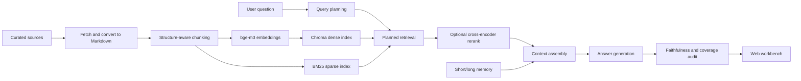

# Enterprise RAG Learning Project

一个面向学习和作品集展示的企业级 RAG Demo。项目从官方文档、论文和开源项目资料构建知识库，支持结构化切分、稠密/稀疏混合检索、query planning、planned retrieval、上下文组装、答案生成、答案审计、长对话记忆和 Web 可视化。

## 当前结果

- 知识库文档：52 篇
- 结构化 chunks：938 个
- 检索：Chroma dense retrieval + BM25 sparse retrieval + RRF
- Embedding：Ollama `bge-m3`
- 生成模型：DeepSeek API 或 Ollama 本地模型
- 可选语义重排：`BAAI/bge-reranker-v2-m3`（Transformers + CUDA FP16）
- 端到端评测：planned hybrid 10/10 通过，quality pass rate 100%
- 检索实验：direct hybrid 双指标通过率 75%，dense 基线为 62.5%
- 重排实验：planned hybrid 在 8/8 问题上保持双指标通过；cross-encoder 未提升总体 nDCG，暂不设为默认

最新评测摘要：

- `eval/rag_system_full_hybrid/summary.md`
- `eval/hybrid_retrieval_experiment/summary.md`
- `eval/planned_reranker_full/summary.md`
- `notes/35_hybrid_retrieval_and_rrf.md`
- `notes/36_cross_encoder_reranker.md`

## Demo 展示

代表性问答案例见：

- `docs/demo.md`

Demo 覆盖复合问题拆解、非固定窗口 chunking、query rewrite/query expansion、Chroma metadata filter、企业级混合检索/重排，以及知识边界拒答。

## 核心能力

- 资料来源可追踪：通过 `data/source_manifests/llm_rag_sources.csv` 维护高质量来源。
- 正式入库流程：fetch -> markdown -> structure-aware chunking -> embedding -> Chroma index。
- 非固定窗口切分：按 Markdown 结构、标题和段落边界切分，再用软/硬长度约束兜底。
- Query planning：先理解问题意图，再生成子查询、分类过滤和必答方面。
- Planned retrieval：多子查询、多分类召回，再做融合、重排和覆盖选择。
- Hybrid retrieval：并行执行 bge-m3 向量召回和 BM25 关键词召回，通过 RRF 按排名融合。
- 可选 Cross-encoder：用问题和候选片段联合打分；支持多语种 GPU 模型、固定候选评测和小显存互斥驻留。
- 上下文组装：区分检索证据和对话记忆，避免把记忆当事实来源引用。
- 答案审计：检查引用、忠实性、相关性、覆盖度和 badcase。
- 长记忆：记录用户偏好和目标，用于连续学习场景。
- Web 工作台：可查看规划、来源、上下文、审计和记忆。

## 架构流程



## 项目结构

```text
src/                         核心 RAG 逻辑
webapp/                      本地 Web 工作台
experiments/16_llm_rag_sources/  资料抓取与 Markdown 转换
experiments/17_llm_rag_chunking/  文档切分
experiments/18_llm_rag_index/     Chroma 索引构建与搜索
experiments/22_rag_system_eval/   Web API 端到端评测
experiments/23_hybrid_retrieval_eval/  Dense/BM25/RRF 对比实验
experiments/24_cross_encoder_rerank_eval/  固定候选重排对比实验
data/source_manifests/       高质量资料来源清单
docs/                        调研记录
notes/                       学习过程与阶段复盘
eval/                        评测摘要和可再生成结果
```

## 环境准备

已经验证过的本地环境：

- Python/conda 环境：`rag-book`
- Ollama：已安装
- 本地 embedding 模型：`bge-m3`
- 可选本地生成模型：`qwen2.5:1.5b`
- 可选远程生成模型：DeepSeek API

创建或进入环境后安装依赖：

```powershell
conda activate rag-book
python -m pip install -r requirements.txt
python -c "import ollama, chromadb; print('ok')"
ollama list
```

4GB NVIDIA 显卡上启用可选多语种重排器：

```powershell
python -m pip install -r requirements-reranker-gpu.txt
python -c "import torch; print(torch.cuda.is_available(), torch.cuda.get_device_name(0))"
```

默认配置使用 `BAAI/bge-reranker-v2-m3`、CUDA FP16、batch size 2 和 512 token 上限。首次选择语义重排时会下载约 2.3GB 模型权重。模型缓存位于 `data/runtime/`，不会提交到 Git。

配置 API key 时，不要提交真实 key。复制 `.env.example` 或在当前终端设置：

```powershell
$env:DEEPSEEK_API_KEY="你的key"
```

## 重建知识库

这些命令会重新生成文档、chunks 和 Chroma 向量库：

```powershell
python experiments\16_llm_rag_sources\fetch_sources.py --priority P0 --sleep 0.1
python experiments\17_llm_rag_chunking\build_chunks.py
python experiments\18_llm_rag_index\build_index.py --rebuild --batch-size 8
```

当前构建结果：

```text
documents: 52
chunks: 938
indexed_count: 938
too_long_chunks: 0
tiny_chunks: 0
```

## 启动 Web 工作台

```powershell
python webapp\server.py --host 127.0.0.1 --port 8765
```

浏览器打开：

```text
http://127.0.0.1:8765
```

## 运行评测

完整端到端评测：

```powershell
python experiments\22_rag_system_eval\evaluate_web_api.py --retrieval-strategy hybrid --output-dir eval\rag_system_full_hybrid
```

最近一次结果：

```text
total: 10
passed: 10
failed: 0
pass_rate: 100%
quality_pass_rate: 100%
```

只评估检索层，不调用生成模型：

```powershell
python experiments\23_hybrid_retrieval_eval\evaluate_hybrid_retrieval.py
```

这组实验固定相同问题和 `top_k`，比较 dense、hybrid、lexical rerank 和 planned retrieval。主要结果：

| 策略 | 双指标通过率 | 类别 MRR | 证据词召回 | 平均检索耗时 |
|---|---:|---:|---:|---:|
| dense | 62.5% | 0.573 | 0.738 | 0.35s |
| hybrid | 75.0% | 0.708 | 0.838 | 0.37s |
| planned dense + lexical | 100% | 0.875 | 0.950 | 8.31s |
| planned hybrid + lexical | 100% | 0.938 | 0.950 | 8.66s |

上一阶段的 lexical rerank 没有继续提高 hybrid 通过率，因此本阶段引入真正的 cross-encoder，并用固定候选池单独评测。

Cross-encoder 评测分为候选生成和重排两个阶段，避免 Ollama embedding 与 GPU reranker 同时驻留，并保证所有策略使用相同候选：

```powershell
python experiments\24_cross_encoder_rerank_eval\evaluate_rerankers.py --retrieval-mode planned --mode none --output-dir eval\planned_reranker_full
python experiments\24_cross_encoder_rerank_eval\evaluate_rerankers.py --retrieval-mode planned --mode none --mode lexical --mode cross_encoder_multilingual --mode cross_encoder_fused --candidate-pools eval\planned_reranker_full\candidate_pools.jsonl --output-dir eval\planned_reranker_full
```

| 规划候选上的策略 | 双指标通过率 | nDCG@7 | 类别 MRR | 证据词召回 | 重排耗时 |
|---|---:|---:|---:|---:|---:|
| none | 100% | 0.725 | 0.938 | 0.950 | 0.00s |
| lexical | 100% | 0.722 | 0.938 | 0.950 | 0.01s |
| bge-reranker-v2-m3 | 100% | 0.700 | 0.938 | 0.950 | 4.79s |
| retrieval/model rank fusion | 100% | 0.701 | 0.875 | 0.950 | 4.83s |

模型在 embedding、query planning 和 vector DB 问题上改善排序，但在 chunking、reranking 和企业复合检索问题上退化。当前默认继续使用 `planned + hybrid + lexical`；Web 中的多语种语义重排保留为实验选项。nDCG 使用固定候选池内的自动标签，不等同于完整人工相关性标注。

## 学习记录

建议按顺序阅读这些阶段记录：

- `notes/24_llm_rag_source_fetching.md`
- `notes/25_llm_rag_chunk_index_qa.md`
- `notes/26_query_planning_and_planned_retrieval.md`
- `notes/27_chunk_topk_rerank_optimization.md`
- `notes/29_web_workbench_and_context_assembly.md`
- `notes/31_long_term_memory_upgrade.md`
- `notes/32_rag_eval_harness.md`
- `notes/34_component_scoped_planning_and_chroma_docs.md`
- `notes/35_hybrid_retrieval_and_rrf.md`
- `notes/36_cross_encoder_reranker.md`

## 适合作品集展示的点

- 不是只做一个简单 QA Demo，而是覆盖了 RAG 的数据、检索、生成、审计、记忆和评测链路。
- badcase 修复不是简单改 prompt，而是先定位问题属于数据、规划、检索、上下文还是审计，再做针对性改进。
- 资料来源偏官方文档、论文和成熟开源项目，适合解释“为什么这样设计”。
- 可以展示从 8/10 到 10/10 的质量迭代过程。

## 下一步方向

- 补充 `environment.yml`，让 conda 环境也能一键创建。
- 给 Web 页面增加更清晰的“答案/来源/审计”展示。
- 增加更多真实业务数据集，验证跨领域泛化。
- 建立人工相关性标注集，再决定是否按问题类型自适应启用 cross-encoder。
- 增加候选与重排结果缓存，降低 planned retrieval 的在线延迟。
- 增加 GitHub Actions 或本地一键评测脚本。
