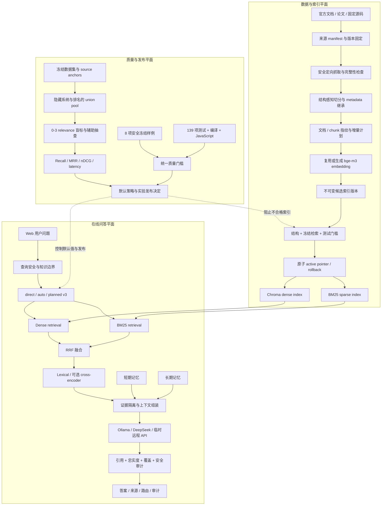
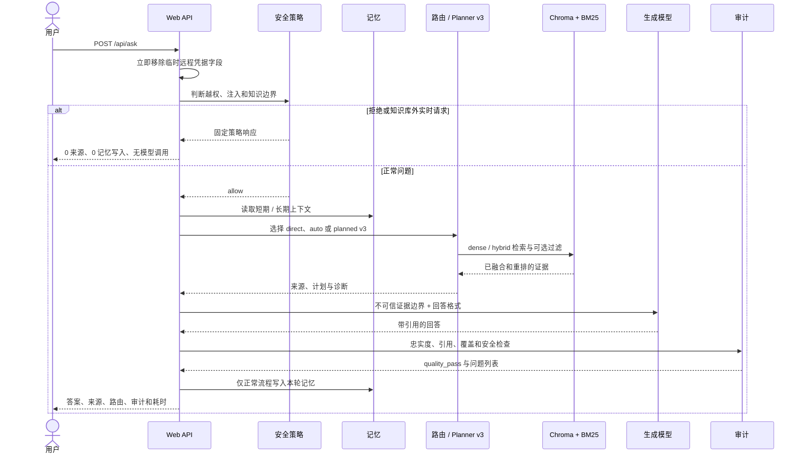
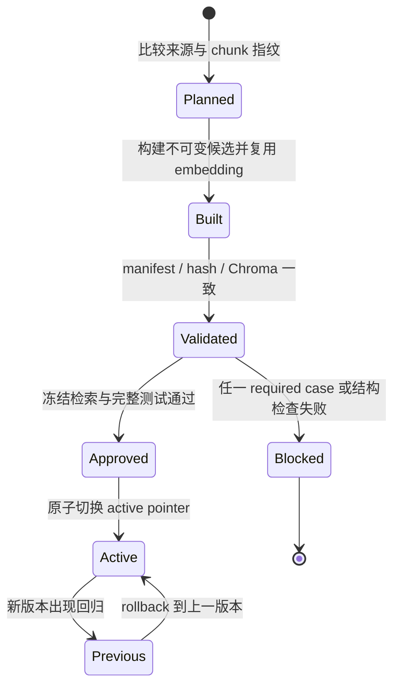

# 系统架构

这套架构把 RAG 拆成三个可以独立解释和验收的平面：数据与索引、在线问答、质量与发布。默认在线路径保持本地 Ollama + direct retrieval；planned v3、cross-encoder 和远程 API 都是显式选择的能力。

## 1. 全局架构

## 2. 单次请求时序

## 3. 索引发布生命周期

构建与启用分离。`--activate` 不能绕过发布门槛；Web 在请求之间检测 active pointer，单次请求始终固定使用同一个索引快照。

## 4. 主要模块映射

| 责任 | 主要实现 |
|---|---|
| 来源、切分与索引构建 | `experiments/16_llm_rag_sources/`、`17_llm_rag_chunking/`、`33_incremental_index/` |
| Dense、BM25、融合与 planned retrieval | `src/retrieval.py`、`src/bm25_retrieval.py`、`src/query_planning.py` |
| 并行召回与缓存 | `src/retrieval_cache.py`、`experiments/35_planned_retrieval_parallel_cache/` |
| 上下文与证据边界 | `src/context_assembly.py` |
| 安全前置与安全审计 | `src/rag_security.py`、`experiments/36_rag_security_regression/` |
| 生成、记忆与 Web API | `webapp/server.py`、`src/long_memory.py` |
| 答案与覆盖审计 | `src/answer_audit.py`、`src/coverage_audit.py` |
| 索引和代码发布门槛 | `src/index_release_gate.py`、`experiments/37_unified_quality_gate/` |

## 5. 设计边界

- `direct` 仍是默认检索模式；holdout 证明 planned v3 无退化，但没有证明显著提升。
- 对话记忆只帮助解释指代和偏好，不是外部事实来源。
- cross-encoder 保留为可选实验能力，固定候选实验没有支持把它设为默认。
- CI 不运行真实索引门槛，因为本地 Chroma、chunks 和 embedding 模型不提交 Git；本地传入 manifest 后补齐这层检查。
- 安全分类器采用高精度确定性规则，目标是建立可重复的工程底线，不冒充通用内容安全系统。

指标证据见 [metrics.md](metrics.md)，决策依据见 [technical_decisions.md](technical_decisions.md)。
